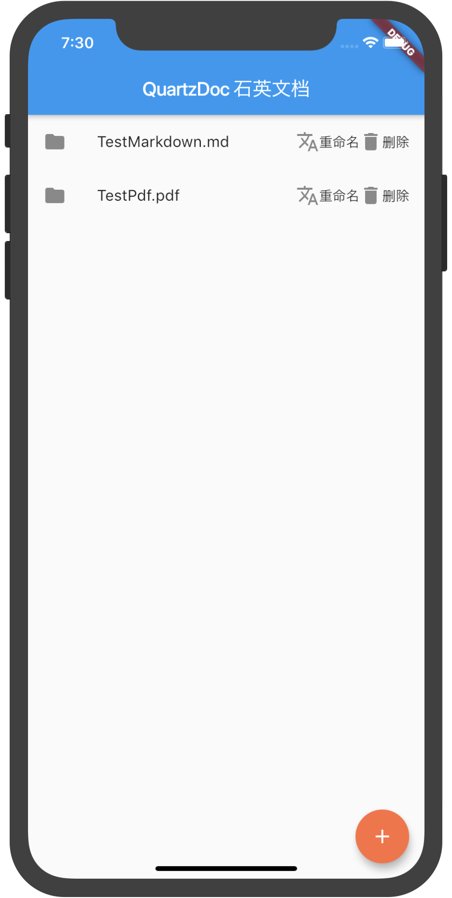
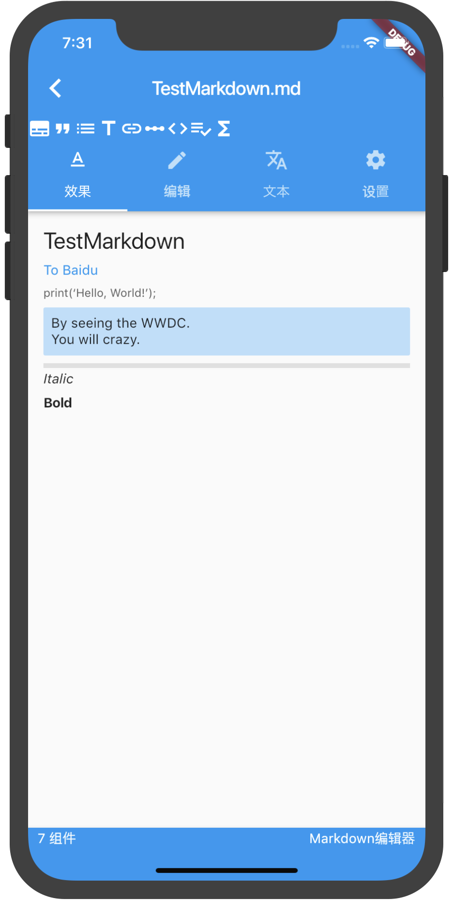
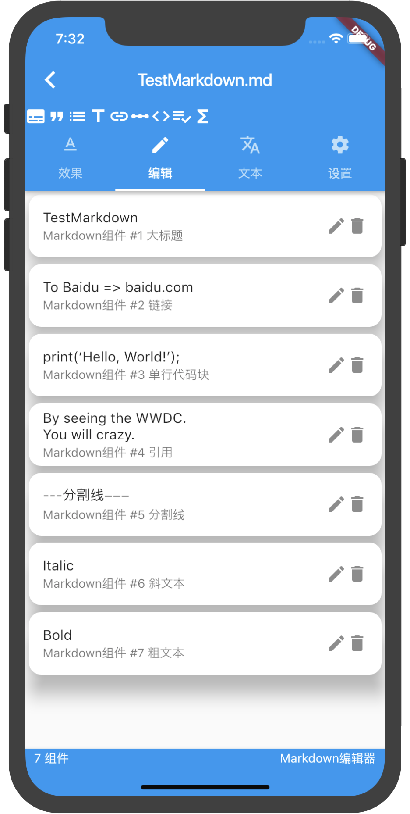
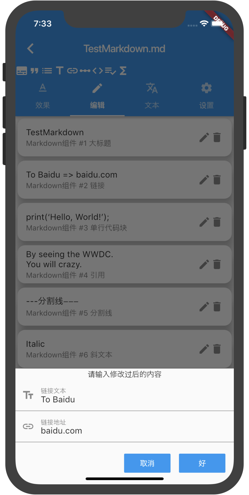
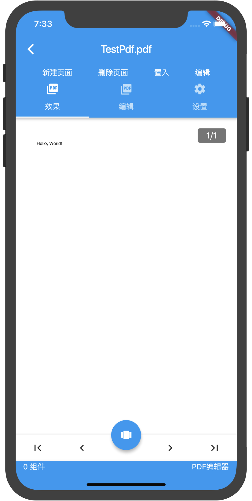

# QuartzDoc 石英文档

一个开源的Flutter文档处理库

(知乎来的小伙伴们施舍个Star吧)

## 注意

该项目尚未开发完毕，仅支持Markdown文档的编辑且不稳定。

本项目目前用于pdf编辑的任何页面及类/文件都无法正常工作且极度不稳定，因为他们根本没有开始开发。

The code here is not stable!
## 示例截图






## 上手指南

* 注: 如果您想要省去一些多余的麻烦，您可以直接在Android/iOS虚拟机里运行本项目中的example模块

以下指南将帮助你在本地项目上引用该项目，进行开发和测试。

- 您的设备上需要配置好Flutter开发环境，详见[Flutter官网](https://flutter-io.cn/docs/get-started/install)。

- 请下载本项目，并将它解压。

- 将解压后的文件夹放入 您的项目文件夹/plugins

- 在pubspec.yaml中加入: 
```yaml
quartz_doc:
    path: plugins/quartz_doc
```

- 执行 Packages Get

- 在您的AndroidManifest.xml中加入:
```xml
<uses-permission android:name="android.permission.WRITE_EXTERNAL_STORAGE"/>
<uses-permission android:name="android.permission.READ_EXTERNAL_STORAGE"/>
```

- 在您代码合适的地方加入外部存储的动态权限申请，这里推荐插件[permission_handler](https://pub.flutter-io.cn/packages/permission_handler)

- iOS 11.0以下的版本不支持文件选取功能，请在初始化QuartzPage中将supportFilePicker设置为false，就像这样
```dart
QuartzPage(
  supportFilePicker: false,
  ...
);
```

- 使用以下语句导入本库:
```dart
import 'package:quartz_doc/quartz_doc.dart';
```

- 使用QuartzDoc进行开发吧！

## 关于

主要开发者:


```text
感谢 Warpin Studio 的其它人员对我的大力支持与鼓励
感谢 Flutter 茶馆 中的小伙伴们对我的大力支持与鼓励
```

## 关于捐赠


## 结尾

本篇README如有任何错误，请立刻指出，谢谢！

Make sure that you need these code 😇